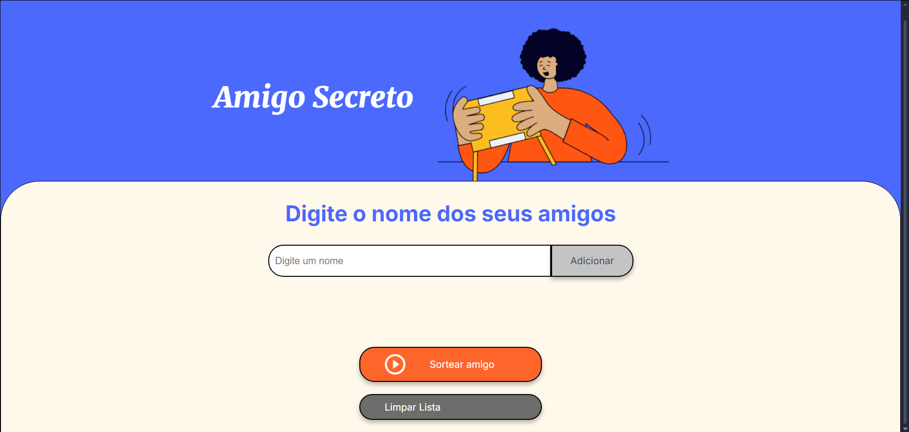
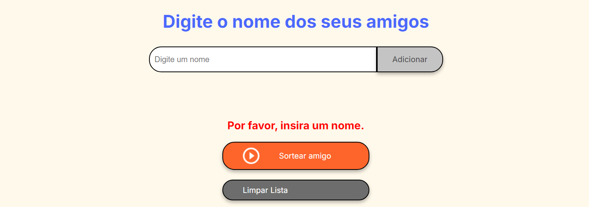
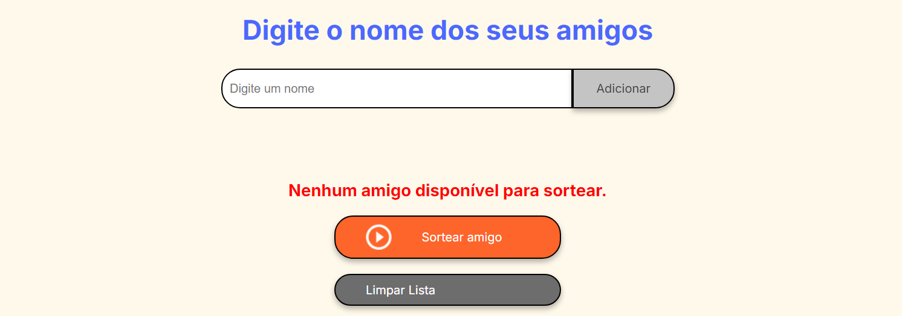
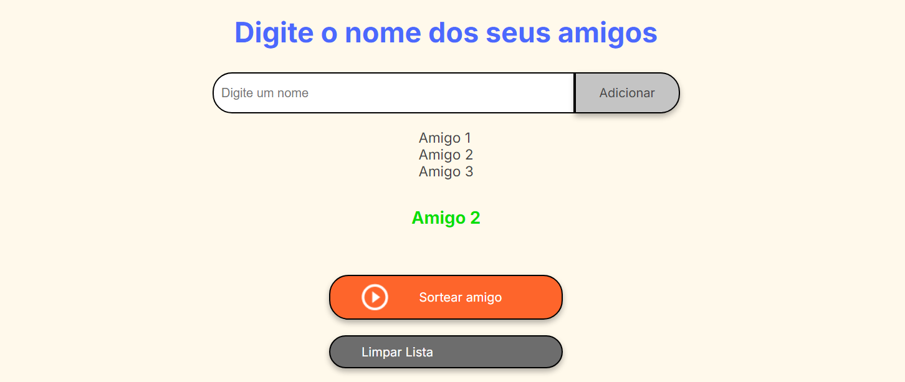

# Amigo Secreto 🎉

Este é um projeto simples para organizar e sortear nomes de amigos para um evento de amigo secreto.

## 🚀 Funcionalidades

- **Adicionar amigos**: Permite inserir o nome de amigos na lista.
- **Exibir a lista de amigos**: Mostra todos os amigos adicionados.
- **Sortear amigo secreto**: Seleciona aleatoriamente um amigo da lista.
- **Limpar lista**: Remove todos os nomes da lista.

## 🛠️ Tecnologias Utilizadas

- **HTML5**: Estrutura da página.
- **CSS3**: Estilo e layout.
- **JavaScript**: Lógica de programação.

## Images

